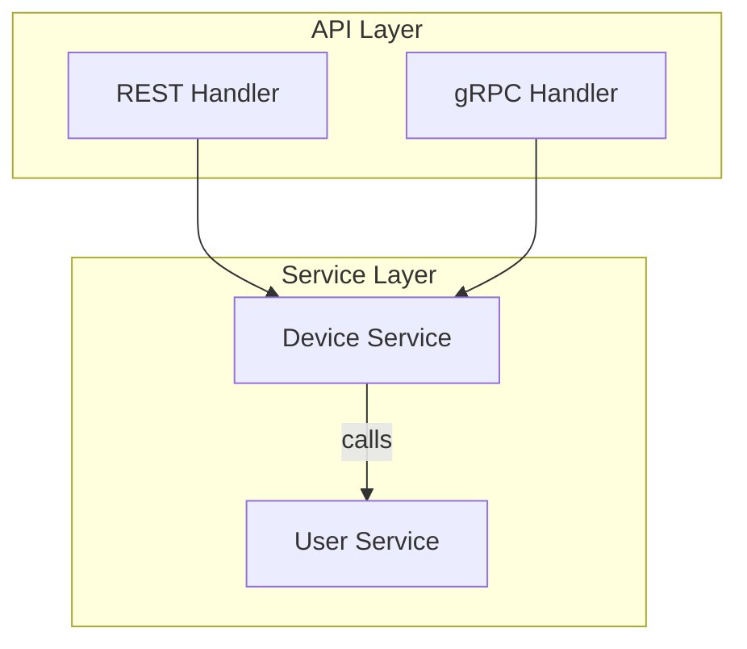
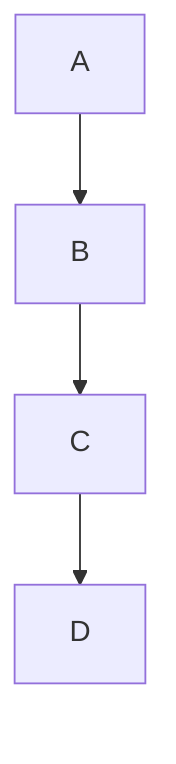
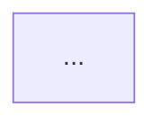

# Content Validation

## Pre-Creation Validation Rules

Before creating any AIDLC documentation file, validate content meets these standards.

---

## Mermaid Diagram Validation

### Required Checks

1. **Syntax validation**: All diagrams must parse without errors
2. **Node naming**: Use descriptive names, not single letters
3. **Edge labels**: Label relationships when not obvious
4. **Subgraph organization**: Group related components

### Valid Example



### Invalid Example (Avoid)



**Problem**: No context about what A, B, C, D represent.

---

## ASCII Diagram Standards

### When to Use ASCII vs Mermaid

| Use ASCII | Use Mermaid |
|-----------|-------------|
| Simple flows (3-5 boxes) | Complex relationships |
| Terminal/CLI output | Rendered documentation |
| Quick sketches in chat | Formal architecture docs |

### ASCII Box Style

```
┌─────────────────────┐
│  Component Name     │
│  • Detail 1         │
│  • Detail 2         │
└─────────────────────┘
```

Use Unicode box-drawing characters:
- `─` horizontal line
- `│` vertical line
- `┌ ┐ └ ┘` corners
- `├ ┤ ┬ ┴ ┼` junctions

### ASCII Flow Style

```
┌──────────┐     ┌──────────┐     ┌──────────┐
│  Input   │────▶│ Process  │────▶│  Output  │
└──────────┘     └──────────┘     └──────────┘
```

Arrow characters:
- `─▶` right arrow
- `◀─` left arrow
- `│` vertical connection
- `▼` down arrow
- `▲` up arrow

---

## Special Character Escaping

### In Markdown Files

| Character | Escape As | Context |
|-----------|-----------|---------|
| `|` | `\|` | Inside tables |
| `*` | `\*` | When not bold/italic |
| `_` | `\_` | When not bold/italic |
| `` ` `` | ``` `` ` `` ``` | Inside code spans |
| `#` | `\#` | When not a heading |
| `<` `>` | `&lt;` `&gt;` | HTML contexts |

### In Code Blocks

No escaping needed inside fenced code blocks (``` or ~~~).

---

## Text Alternatives

### For Diagrams

Every diagram must have a text description:

```markdown
## Architecture Diagram

[Diagram description: Shows three-tier architecture with REST/gRPC handlers
connecting to service layer, which connects to PostgreSQL and Redis.]


```

### For Complex Tables

If a table exceeds 5 columns, provide a summary:

```markdown
## Field Mapping (Summary)

This table maps 12 proto fields to database columns with their types and constraints.
Key relationships: DeviceID is the primary key, UserID links to users table.

| Field | Column | Type | ... |
```

---

## File Structure Validation

### Required Sections

Every AIDLC document should include:

1. **Title** (H1) — What this document is
2. **Purpose** — Why it exists (1-2 sentences)
3. **Content** — The actual information
4. **Related Files** (optional) — Links to related artifacts

### Example Structure

```markdown
# Requirements Analysis: Team Alpha

**Purpose**: Captures validated requirements for the device posture feature.

## Requirements

[Content here]

## Open Questions

[If any remain]

## Related Files

- Vision: `workshop/inputs/alpha-vision.md`
- Tech Env: `workshop/templates/tech-env-secureedge.md`
```

---

## Validation Checklist

Before saving any file, verify:

- [ ] **Mermaid diagrams** parse without syntax errors
- [ ] **ASCII diagrams** use proper box-drawing characters
- [ ] **Special characters** are escaped where needed
- [ ] **Diagrams have text descriptions** for accessibility
- [ ] **File has required sections** (title, purpose, content)
- [ ] **Links are valid** (relative paths exist)
- [ ] **No placeholder text** remains (remove `[TODO]`, `[TBD]`, `...`)

---

## Common Mistakes

### Mermaid

| Mistake | Fix |
|---------|-----|
| Missing quotes around labels with spaces | `A["My Label"]` not `A[My Label]` |
| Using reserved words as node IDs | Avoid `end`, `graph`, `subgraph` as IDs |
| Forgetting direction | Always specify `flowchart TD` or `LR` |

### ASCII

| Mistake | Fix |
|---------|-----|
| Using `-` instead of `─` | Use proper box-drawing characters |
| Inconsistent box sizes | Align all boxes in a row |
| Missing arrow heads | Use `▶` not just `>` |

### Markdown

| Mistake | Fix |
|---------|-----|
| Unescaped pipes in tables | Use `\|` inside table cells |
| Raw URLs | Use `[text](url)` format |
| Missing blank lines | Add blank line before/after code blocks |
